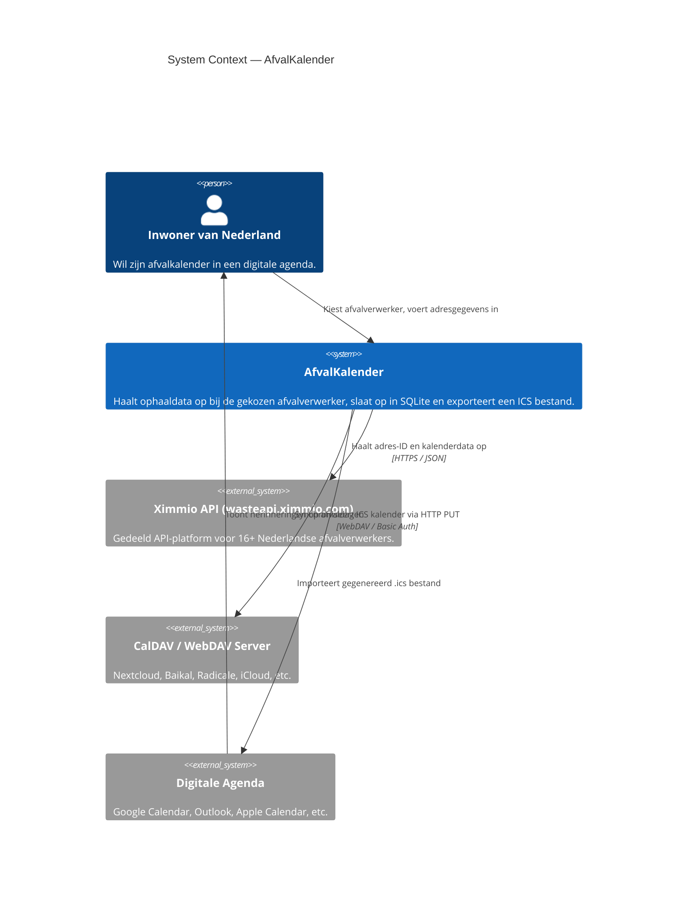
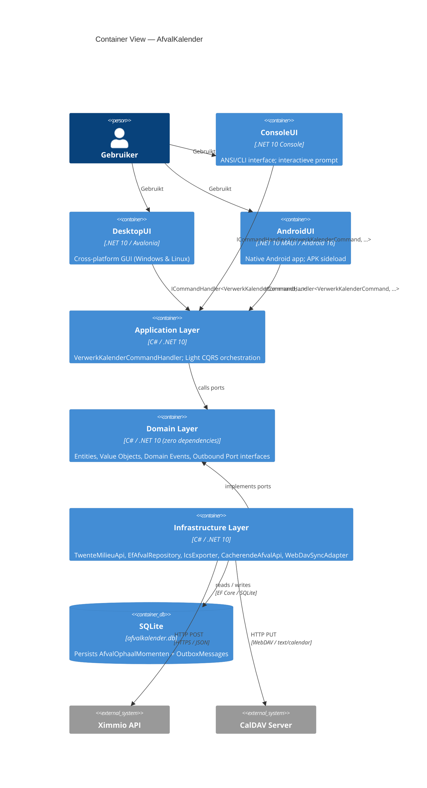
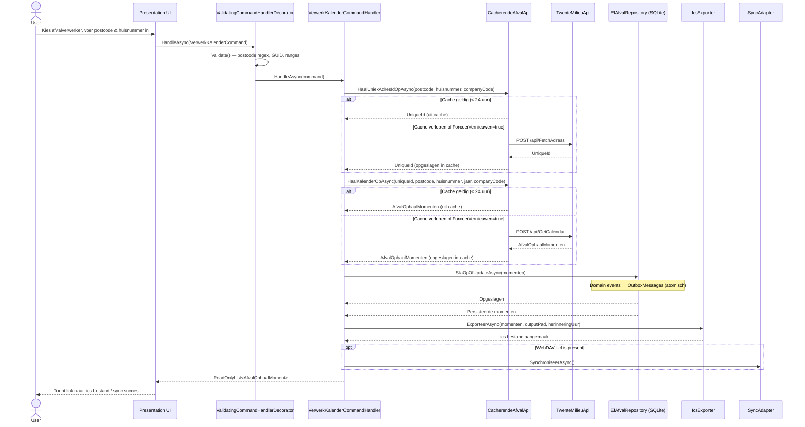

# CLAUDE.md — Technical Overview for Contributors

This file is the authoritative technical reference for the **AfvalKalender** project.
It is intended for new contributors, AI assistants, and code reviewers who need a
complete architectural picture before making changes.

---

## Quick-Start Commands

```bash
# Build
dotnet build
dotnet build --configuration Release

# Run
dotnet run --project AfvalKalender.ConsoleUI
dotnet run --project AfvalKalender.DesktopUI

# Test
dotnet test AfvalKalender.UnitTests/AfvalKalender.UnitTests.csproj          # domain + application
dotnet test AfvalKalender.Infrastructure.Tests/AfvalKalender.Infrastructure.Tests.csproj
dotnet test AfvalKalender.DesktopUI.Tests/AfvalKalender.DesktopUI.Tests.csproj

# Run a single test by name
dotnet test AfvalKalender.UnitTests --filter "FullyQualifiedName~AdresTests.Constructor_MetGeldigeData"

# Publish self-contained executables
dotnet publish -c Release -r win-x64 --self-contained
dotnet publish -c Release -r linux-x64 --self-contained

# Build Android APK (requires Android SDK + JDK 21 installed locally)
dotnet build-server shutdown && dotnet publish AfvalKalender.AndroidUI \
  -c Release \
  -f net10.0-android \
  -p:RuntimeIdentifier=android-arm64 \
  -p:AndroidPackageFormat=apk \
  -p:AndroidKeyStore=false \
  -p:SkipUsingBuiltInWorkloads=true \
  -p:NoWarn=NU1605 \
  -p:AndroidSdkDirectory=$HOME/.android/sks \
  -p:JavaSdkDirectory=/usr/lib/jvm/java-21-openjdk-amd64
```

> **Note:** `dotnet test` at solution level fails for Android projects due to the
> missing SDK in CI. Run each test project individually as shown above.

---

## What This Application Does

AfvalKalender fetches Dutch household waste-collection schedules from the
**Ximmio API** (`wasteapi.ximmio.com`), persists them locally in SQLite, and
exports a standards-compliant `.ics` calendar file that can be imported directly
into Google Calendar, Outlook, or Apple Calendar.

It supports **16 Dutch waste processors** (Twente Milieu, ACV, Avalex, Avri, …)
all sharing the same Ximmio API endpoint, differentiated by a `CompanyCode` (UUID).

---

## Architecture

### Governing principle: Hexagonal / Clean Architecture

The core business logic (`Domain` + `Application`) knows **nothing** about databases,
HTTP, or user interfaces. All external concerns are connected through explicit ports
(interfaces in the Domain layer) and adapters (implementations in Infrastructure and
Presentation).

**Dependency flow (nothing may violate this):**

```
Presentation  →  Application  →  Domain  ←  Infrastructure
```

### C4 — System Context



### C4 — Container View



### Layer responsibilities

| Layer | Project | Responsibility |
|---|---|---|
| **Domain** | `AfvalKalender.Domain` | Entities, value objects, domain events, outbound port interfaces. Zero NuGet dependencies. |
| **Application** | `AfvalKalender.Application` | Use-case orchestration (Light CQRS). Inbound port contract. Command validation pipeline. |
| **Infrastructure** | `AfvalKalender.Infrastructure` | Driven adapters: HTTP, SQLite/EF Core, ICS generation, file cache, WebDAV sync. |
| **Presentation** | `AfvalKalender.ConsoleUI` / `DesktopUI` / `AndroidUI` | Thin driving adapters. Resolve `ICommandHandler` from DI and forward user input. |

---

## Domain Model (Dutch Ubiquitous Language)

All domain identifiers, entity names, method names, and event names are in **Dutch**,
matching the language of the problem domain and the team.

### Entities

| Entity | Dutch name | Description |
|---|---|---|
| `AfvalOphaalMoment` | Afval Ophaal Moment | A single scheduled waste-collection date for an address. Rich entity with `Update()` encapsulating change detection and event emission. |
| `Adres` | Adres | A postal address (postcode + huisnummer) used as a look-up key. |

### Value Objects

| Value Object | Dutch name | Description |
|---|---|---|
| `AfvalType` | Afval Type | Enum: `GRIJS`, `GROEN`, `PAPIER`, `GFT`, `GLAS`, `TEXTIEL`, `ONBEKEND`. |
| `AfvalVerwerker` | Afval Verwerker | Immutable `record(Id, Naam, CompanyCode)`. `AfvalVerwerkers.Alle` lists all 16 supported providers. |

### Domain Events

| Event | Dutch name | Raised when |
|---|---|---|
| `AfvalOphaalMomentToegevoegd` | Moment Toegevoegd | A new `AfvalOphaalMoment` is constructed. |
| `AfvalOphaalMomentGewijzigd` | Moment Gewijzigd | `Update()` detects a description change. |

Both implement `IDomainEvent` which exposes `OccurredOn`.

### Outbound Ports (Interfaces in Domain)

| Interface | Purpose |
|---|---|
| `IAfvalApi` | Fetch address ID and calendar from Ximmio API. |
| `IAfvalRepository` | Persist and query `AfvalOphaalMomenten`. |
| `IIcsExporter` | Generate a `.ics` file from a list of moments. |
| `IAfvalKalenderSynchronisator` | Push calendar to a remote WebDAV/CalDAV server. |

---

## Application Layer — Light CQRS

> See [ADR-001](docs/adr/ADR-001-light-cqrs-icommandhandler.md) for the full decision record.

```
ICommandHandler<TCommand, TResult>          ← inbound port contract
VerwerkKalenderCommand                      ← immutable record; carries user input
VerwerkKalenderCommandHandler               ← orchestrator; calls outbound ports
ValidatingCommandHandlerDecorator<T,R>      ← cross-cutting validation wrapper
VerwerkKalenderCommandValidator             ← validates postcode, jaar, GUID, etc.
```

### VerwerkKalenderCommand fields

| Field | Type | Default | Constraint |
|---|---|---|---|
| `Postcode` | `string` | — | Required; `^[1-9][0-9]{3}[A-Z]{2}$` |
| `Huisnummer` | `string` | — | Required (non-whitespace) |
| `Jaar` | `int` | — | 2000–2100 |
| `HerinneringUur` | `int` | — | 0–23 |
| `OutputPad` | `string` | — | Required (non-whitespace) |
| `CompanyCode` | `string` | Twente Milieu GUID | Must be a parseable `Guid` |
| `ForceerVernieuwen` | `bool` | `false` | Bypass 24-hour API cache |
| `WebDavUrl` | `string?` | `null` | Optional WebDAV destination |
| `WebDavGebruiker` | `string?` | `null` | Optional WebDAV basic auth username |
| `WebDavWachtwoord`| `string?` | `null` | Optional WebDAV basic auth password |

### Core workflow (`VerwerkKalenderCommandHandler.HandleAsync`)



---

## Infrastructure Adapters

| Adapter | Implements | Pattern | Notes |
|---|---|---|---|
| `TwenteMilieuApi` | `IAfvalApi` | HTTP Client | Posts to `wasteapi.ximmio.com`; SSL validation bypassed (self-signed cert). |
| `CacherendeAfvalApi` | `IAfvalApi` | Decorator | 24h file cache; `companyCode` in filename; injectable clock for tests. See [ADR-005](docs/adr/ADR-005-api-cache-decorator.md). |
| `EfAfvalRepository` | `IAfvalRepository` | Repository + Outbox | Upserts entities; harvests domain events into `OutboxMessages` in same transaction. See [ADR-004](docs/adr/ADR-004-domain-events-outbox.md). |
| `IcsExporter` | `IIcsExporter` | File writer | Writes RFC 5545 `.ics` using Ical.Net; UIDs scoped per `type+date+postcode`. |
| `WebDavSyncAdapter` | `IAfvalKalenderSynchronisator` | HTTP Client | Generates temp ICS, HTTP PUTs to CalDAV server with optional Basic Auth. See [ADR-002](docs/adr/ADR-002-webdav-caldav-sync.md). |

---

## Project Structure

```
AfvalKalender/
├── AfvalKalender.Domain/
│   ├── Entities/          Adres, AfvalOphaalMoment
│   ├── Events/            IDomainEvent, AfvalOphaalMomentToegevoegd, AfvalOphaalMomentGewijzigd
│   ├── Interfaces/        IAfvalApi, IAfvalRepository, IIcsExporter, IAfvalKalenderSynchronisator
│   └── ValueObjects/      AfvalType, AfvalVerwerker (+ AfvalVerwerkers.Alle)
│
├── AfvalKalender.Application/
│   ├── Commands/          ICommandHandler, ICommandValidator, ValidatingCommandHandlerDecorator,
│   │                      VerwerkKalenderCommand, VerwerkKalenderCommandHandler,
│   │                      VerwerkKalenderCommandValidator
│   └── Services/          AfvalService (legacy; superseded by handler — kept for reference)
│
├── AfvalKalender.Infrastructure/
│   ├── Api/               TwenteMilieuApi
│   ├── Cache/             CacherendeAfvalApi
│   ├── Ics/               IcsExporter
│   ├── Persistence/       AfvalDbContext, EfAfvalRepository, OutboxMessage
│   └── Sync/              WebDavSyncAdapter
│
├── AfvalKalender.ConsoleUI/          ANSI/CLI driving adapter
├── AfvalKalender.DesktopUI/          Avalonia MVVM driving adapter
├── AfvalKalender.AndroidUI/          .NET MAUI driving adapter (Android 16)
│
├── AfvalKalender.UnitTests/          Domain + Application tests (xUnit)
├── AfvalKalender.Infrastructure.Tests/  Repository + Cache + Sync tests (xUnit + EF InMemory)
├── AfvalKalender.DesktopUI.Tests/    Avalonia headless ViewModel tests
├── AfvalKalender.AndroidUI.Tests/    Android ViewModel tests
│
└── docs/
    └── adr/
        ├── ADR-001-light-cqrs-icommandhandler.md
        ├── ADR-002-webdav-caldav-sync.md
        ├── ADR-003-command-validation-decorator.md
        ├── ADR-004-domain-events-outbox.md
        └── ADR-005-api-cache-decorator.md
```

---

## Key Design Decisions

| Decision | Rule |
|---|---|
| **Dutch Ubiquitous Language** | All domain names, method names, and event names are in Dutch. |
| **No EF Migrations** | Schema created via `EnsureCreated()` on startup. Simple; no migration history needed for this scope. |
| **SSL bypass on HttpClient** | Ximmio API uses a self-signed certificate. Bypassed only for those specific `HttpClient` instances. |
| **Multi-provider via CompanyCode** | `AfvalVerwerkers.Alle` in the Domain lists all providers. The selected UUID travels through the command to every API call. |
| **Postcode normalisation** | All UIs strip spaces before building the command (`"1234 AB"` → `"1234AB"`). |
| **Idempotent upserts** | Re-running updates only records whose `Omschrijving` changed. `LaatstGewijzigd` tracks when. |
| **ICS UIDs scoped** | UIDs are `type + date + postcode` — prevents calendar app duplicates on re-import. |
| **MVVM source generators** | `[ObservableProperty]` and `[RelayCommand]` from CommunityToolkit.Mvvm used in Desktop + Android ViewModels. |
| **No MediatR** | Hand-rolled `ICommandHandler<T,R>` is simpler, fully traceable, and avoids a major dependency. |

---

## DDD Tactical Patterns

| Pattern | Rule |
|---|---|
| **Aggregate Root** | Enforces all invariants. References other aggregates by Id only. |
| **Entity** | Stable identity over time. `AfvalOphaalMoment` has `Id` (EF-managed). |
| **Value Object** | Immutable; structural equality. Use C# `record` or `init`-only props. `AfvalVerwerker`, `AfvalType`. |
| **Domain Event** | Past-tense Dutch name. Raised inside the entity. Never dispatched synchronously to infrastructure. |
| **Repository** | Interface in Domain; implementation in Infrastructure. Never expose `IQueryable` through the port. |
| **Domain Service** | Stateless; spans multiple aggregates. No Domain Services currently — logic fits inside entities. |

---

## Testing Conventions

- **Frameworks:** xUnit · FluentAssertions · Moq · EF Core InMemory · Avalonia.Headless.XUnit
- **Test name format:** `Method_Scenario_ExpectedResult` in Dutch
  (e.g., `Constructor_MetGeldigeData_ZouAdresMoetenAanmaken`)
- **Never mock domain entities** — instantiate them directly
- **Mock outbound ports** (`IAfvalApi`, `IAfvalRepository`, `IIcsExporter`, `IAfvalKalenderSynchronisator`) via Moq
- **Repository tests** use EF Core InMemory provider
- **ViewModel tests** use `Avalonia.Headless` with a mocked `ICommandHandler<,>`
- **Sync adapter tests** use `Moq.Protected` to intercept `HttpMessageHandler.SendAsync`
- **Cache tests** inject a fake clock (`Func<DateTime>`) to control TTL expiry

---

## Third-Party Library Policy

Evaluate every new NuGet package against:
> *"Can we implement this ourselves with manageable code, or does this library add enough value to justify the dependency?"*

**Order of preference:**
1. Custom implementation (Commands/Handlers, Result types, validation rules)
2. BCL / .NET Runtime
3. Open Source MIT or Apache 2.0 — widely adopted, actively maintained
4. Commercial / restrictively licensed — only after explicit approval

**Current production dependencies (minimal):**

| Package | Layer | Purpose |
|---|---|---|
| `Microsoft.EntityFrameworkCore.Sqlite` | Infrastructure | SQLite persistence |
| `Ical.Net` | Infrastructure | RFC 5545 ICS generation |
| `Newtonsoft.Json` | Infrastructure | Ximmio API response parsing + Outbox serialisation |
| `Avalonia` + `Avalonia.Desktop` | DesktopUI | Cross-platform GUI |
| `CommunityToolkit.Mvvm` | DesktopUI + AndroidUI | MVVM source generators |
| `.NET MAUI` | AndroidUI | Cross-platform mobile framework |

---

## Architecture Decision Records

All ADRs live in [`docs/adr/`](docs/adr/).

| ADR | Title | Status |
|---|---|---|
| [ADR-001](docs/adr/ADR-001-light-cqrs-icommandhandler.md) | Light CQRS via hand-rolled ICommandHandler | Accepted |
| [ADR-002](docs/adr/ADR-002-webdav-caldav-sync.md) | WebDAV/CalDAV sync via IAfvalKalenderSynchronisator | Accepted |
| [ADR-003](docs/adr/ADR-003-command-validation-decorator.md) | Command Validation via Decorator Pipeline | Accepted |
| [ADR-004](docs/adr/ADR-004-domain-events-outbox.md) | Domain Events and Transactional Outbox Pattern | Accepted |
| [ADR-005](docs/adr/ADR-005-api-cache-decorator.md) | 24-Hour File-Based API Cache with ForceerVernieuwen Bypass | Accepted |
| [ADR-006](docs/adr/ADR-006-oauth2-calendar-apis.md) | OAuth2 Synchronization via Native Cloud APIs (Google & Microsoft) | Proposed |

---

## Multi-Disciplinary Team Lens

When answering questions or generating code, reason through the combined perspective
of our cross-functional Scrum team:

- **Senior Software Architect & DDD Expert** — strict bounded context boundaries,
  core domain purity, invariant enforcement, structural consistency, no framework bleed.
- **Senior Software Engineer** — robust, performance-optimised, readable, type-safe
  C# / .NET 10. Minimal but deliberate use of third-party libraries.
- **Product Owner & Business Analyst** — maximising user value; zero-friction UX
  (reuse native phone/desktop calendars instead of forcing app installations).
- **Quality Specialist / Test Engineer** — automated testability via xUnit,
  FluentAssertions, and Moq.
