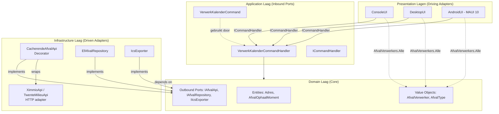
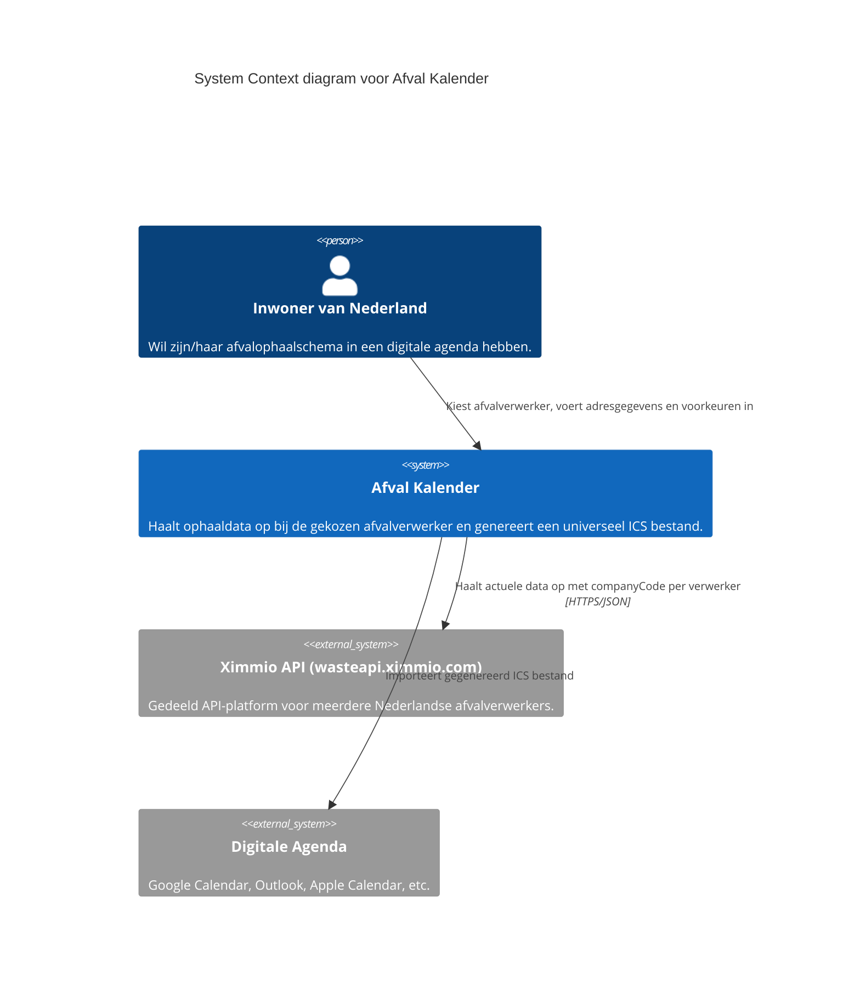
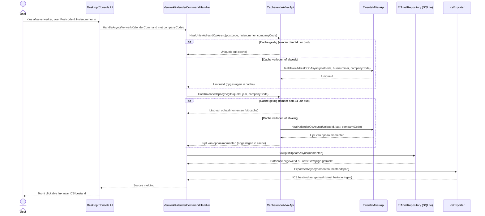

# AfvalKalender Exporteur (.NET)

Een moderne C# .NET console, desktop en mobiele applicatie om afvalophaalschema's op te halen bij Nederlandse afvalverwerkers en te exporteren naar een `.ics` bestand voor gebruik in digitale agenda's zoals Google Calendar of Outlook.

## Doel van de applicatie

De applicatie automatiseert het proces van het bijhouden van de afvalkalender. In plaats van handmatig data over te nemen of een onhandige PDF te gebruiken, haalt dit programma de actuele data op direct bij de bron (Ximmio afvalverwerker API), slaat deze op in een lokale database, en genereert een gestandaardiseerd kalenderbestand met instelbare herinneringen. De applicatie ondersteunt meerdere afvalverwerkers in Nederland die gebruik maken van de Ximmio API.

## Functionaliteiten

-   **Meerdere afvalverwerkers:** Kies uit 16 ondersteunde afvalverwerkers in Nederland (Twente Milieu, ACV, Almere, Avalex, Avri, en meer).
-   **Postcode & Huisnummer:** Voer je eigen adresgegevens in.
-   **API Integratie:** Haalt data op via de Ximmio afvalverwerker API.
-   **Lokale Database:** Slaat ophaalmomenten op in een SQLite database.
-   **Update Logica:** Herkent wijzigingen in het ophaalschema en werkt deze bij, inclusief een tijdstempel van de laatste wijziging.
-   **ICS Export & Share:** Genereert een `.ics` bestand of deelt deze direct met je agenda-app op mobiel.
-   **Aanpasbare Reminders:** Stel zelf in hoeveel uur van tevoren je een melding wilt krijgen.
-   **Nederlandstalig:** De interface en kalender-omschrijvingen zijn volledig in het Nederlands.
-   **Groene Recycle Branding:** Een frisse, herkenbare interface met recycle-icoon.
-   **API Cache:** Slaat API-antwoorden 24 uur op in lokale cachebestanden om rate-limiting te voorkomen.

## Gebruik

### Vereisten
-   **.NET 10.0 SDK** (als u de broncode zelf wilt compileren).
-   Geen vereisten als u de **Self-contained executables** gebruikt van de [GitHub Releases](https://github.com/marvinstorage/AfvalKalender/releases) pagina.

De applicatie is beschikbaar in drie varianten:
1.  **Console UI:** Een interactieve tekst-interface.
2.  **Desktop GUI:** Een grafische interface (Windows & Linux).
3.  **Android App:** Een native mobiele app (.apk).

### Uitvoeren vanaf de broncode

#### Console UI
```bash
dotnet run --project AfvalKalender.ConsoleUI
```

#### Desktop GUI
```bash
dotnet run --project AfvalKalender.DesktopUI
```

#### Android App (MAUI)
```bash
dotnet build AfvalKalender.AndroidUI -t:Run -f net10.0-android
```

### Self-contained Executables (Zonder .NET installatie)
U kunt kant-en-klare versies downloaden voor uw systeem:

#### Desktop GUI (Aanbevolen)
- **Windows:** Download `AfvalKalender_Exporteur_GUI_v1.2.0_win-x64.exe`.
- **Linux:** Download `AfvalKalender_Exporteur_GUI_v1.2.0_linux-x64`.

#### Console UI
- **Windows:** Download `AfvalKalender_Exporteur_CLI_v1.2.0_win-x64.exe`.
- **Linux:** Download `AfvalKalender_Exporteur_CLI_v1.2.0_linux-x64` of installeer via het `.deb` pakket.

#### Android App
- **Android:** Download `AfvalKalender_Exporteur_v1.2.0.apk` voor side-loading op apparaten zoals de Pixel 7 of Motorola G84.

---

### Installatie via .DEB (Ubuntu/Debian)
Voor Ubuntu-gebruikers is er een `.deb` pakket beschikbaar:
1. Download `afvalkalender-exporteur_1.2.0_amd64.deb` van de releases pagina.
2. Installeer het pakket:
   ```bash
   sudo dpkg -i afvalkalender-exporteur_1.2.0_amd64.deb
   ```
3. U kunt de applicatie nu overal starten met het commando:
   ```bash
   afvalkalender-exporteur
   ```

---

## Architectuur en Design

De applicatie is opgezet volgens moderne software engineering principes, met een focus op testbaarheid, onderhoudbaarheid en ontkoppeling van externe systemen.

### 1. Hexagonale Architectuur (Clean Architecture)
We gebruiken een **Hexagonale Architectuur** (ook wel Ports & Adapters genoemd). Dit zorgt ervoor dat de kern van de applicatie (het Domein en de Applicatielaag) volledig onafhankelijk is van de gebruikersinterface, de database en de externe API's van afvalverwerkers.

-   **Domein Laag:** Bevat de pure business logica, entiteiten (`Adres`, `AfvalOphaalMoment`) en de definities van de uitgaande poorten (Interfaces). Geen externe afhankelijkheden.
-   **Applicatie Laag:** Bevat de use-case orkestratie. We gebruiken een **Light CQRS** patroon met een hand-gerolde `ICommandHandler`. Dit vervangt complexe libraries zoals MediatR en biedt een duidelijke 'inbound port' voor alle interfaces.
-   **Infrastructure Laag:** Bevat de concrete implementaties ('adapters') voor de buitenwereld, zoals de `TwenteMilieuApi` (HTTP), `EfAfvalRepository` (SQLite) en de `IcsExporter`.
-   **Presentation Laag:** De verschillende interfaces (Console, Desktop, Android) zijn slechts dunne schillen die commando's sturen naar de applicatielaag.



### 2. Moderne Mobile Development (MAUI 10)
De Android applicatie is geoptimaliseerd voor **.NET 10** en **Android 16** readiness:
-   **CreateWindow Pattern:** Gebruikt het nieuwste MAUI windowing model voor betere lifecycle management.
-   **Compiled Bindings:** Alle XAML bindings zijn voorzien van `x:DataType` voor maximale runtime performance en compile-time validatie.

### 3. Systeem Context (C4 Model)
Dit diagram laat zien hoe de applicatie samenwerkt met de gebruiker en externe systemen.



### 3. Procesverloop (Sequence Diagram)
Hieronder zie je de stappen die de applicatie doorloopt wanneer er op de "Verwerk" knop wordt gedrukt of het commando wordt uitgevoerd.



### 4. Domain Driven Design (DDD) & Event Storming
De structuur is gebaseerd op een duidelijke domeintaal (Ubiquitous Language). Concepten uit de realiteit, zoals "ophaalmomenten", zijn direct terug te vinden in de code. De logica rondom het updaten van ophaalmomenten is ingekapseld in de entiteit zelf (`Update` methode), wat zorgt voor een rijk domeinmodel in plaats van een anemic model.

### 5. Business Logic Details
-   **Afvalverwerker selectie:** De gebruiker kiest een verwerker uit `AfvalVerwerkers.Alle` (value object in het domein). De bijbehorende `CompanyCode` (een UUID) wordt meegegeven in `VerwerkKalenderCommand` en doorgegeven aan alle Ximmio API-aanroepen via de `IAfvalApi` poort. Alle ondersteunde verwerkers gebruiken hetzelfde JSON-formaat.
-   **Postcode normalisatie:** Spaties in de postcode worden automatisch verwijderd in alle UIs (Console, Desktop, Android) vóór het aanmaken van het commando (`"1234 AB"` → `"1234AB"`). De Ximmio API accepteert geen postcodes met spaties.
-   **Uniek Adres:** De API vereist eerst een `UniqueId` op basis van postcode, huisnummer en `companyCode` voordat de kalender opgehaald kan worden. Als het adres niet gevonden wordt, geeft de applicatie een duidelijke foutmelding dat het adres mogelijk buiten het servicegebied van de geselecteerde verwerker valt.
-   **Idempotentie:** Als de applicatie meerdere keren wordt gedraaid voor hetzelfde jaar, zullen bestaande momenten in de database worden bijgewerkt als de omschrijving is veranderd. De kolom `LaatstGewijzigd` houdt bij wanneer dit voor het laatst is gebeurd.
-   **Reminder Trigger:** De ICS exporter gebruikt een relatieve trigger (`-PTnH`) om herinneringen in te stellen op het exacte aantal uren dat de gebruiker heeft opgegeven.
-   **API Cache:** `CacherendeAfvalApi` slaat zowel het adres-ID als de kalenderdata op als JSON-bestanden in de map `apicache/` (of de cache-directory van het platform op mobiel). De `companyCode` maakt deel uit van de bestandsnaam zodat cache-entries per verwerker worden gescheiden. De cache is 24 uur geldig. De cache kan worden gepasseerd/geïnvalideerd door de `ForceerVernieuwen` parameter op de command/API-aanroep te gebruiken.

## Minimale Afhankelijkheden
De applicatie is ontworpen om zo min mogelijk externe libraries te gebruiken:
-   `Microsoft.EntityFrameworkCore.Sqlite`: Voor de database (GPL-compatibel).
-   `Ical.Net`: Voor het genereren van het ICS formaat (MIT - GPL compatibel).
-   `Newtonsoft.Json`: Voor API verwerking (MIT - GPL compatibel).
-   `Avalonia`: Voor de cross-platform GUI (MIT).
-   `CommunityToolkit.Mvvm`: Voor MVVM patronen in de GUI (MIT).

## Licentie
Dit project is gelicentieerd onder de **GNU General Public License v3.0 (GPL-3.0)**. Zie het [LICENSE](LICENSE) bestand voor de volledige tekst.
