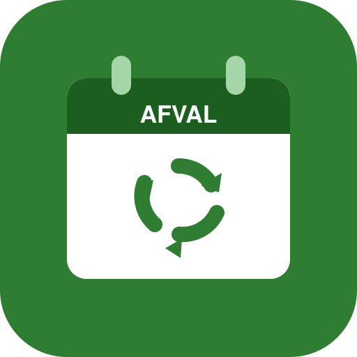
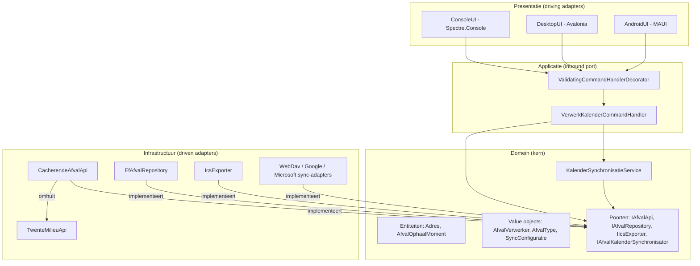
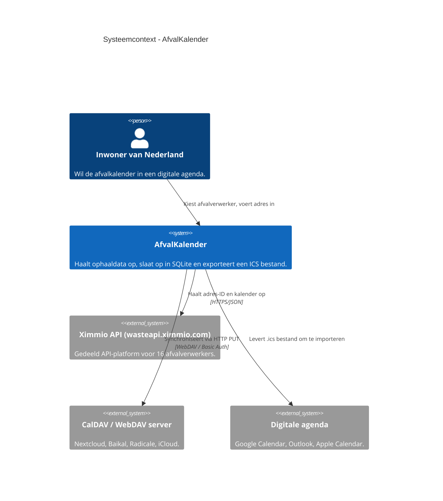
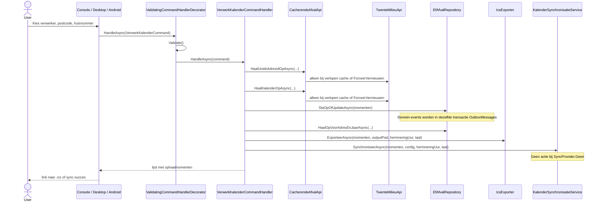

<div align="center">



# AfvalKalender

**Je afvalkalender in je eigen agenda: ophaaldata van 16 Nederlandse afvalverwerkers, als `.ics` bestand of via sync.**

[](https://github.com/marvinstorage/AfvalKalender/actions/workflows/ci.yml)
[](https://github.com/marvinstorage/AfvalKalender/releases/latest)

[Downloaden](#downloaden-en-installeren) · [Ontwikkelaarsdocs](docs/dev/README.md) · [Bijdragen](CONTRIBUTING.md) · [Architectuurbesluiten](docs/adr/) · [Specificaties](openspec/specs/README.md) · [Changelog](CHANGELOG.md)

</div>

AfvalKalender haalt afvalophaalschema's op bij Nederlandse afvalverwerkers (via de Ximmio API), slaat ze lokaal op in SQLite en exporteert een standaard `.ics` bestand voor Google Calendar, Outlook of Apple Calendar, met instelbare herinneringen. Het is gebouwd met C# en .NET 10 volgens een hexagonale architectuur (Ports and Adapters) en bestaat in drie varianten: een terminal-app (TUI), een desktop-app en een Android-app.

> **Wil je meebouwen?** Begin bij de [ontwikkelaarsdocs](docs/dev/README.md) en lees [CONTRIBUTING.md](CONTRIBUTING.md). De ontwikkelaarsdocs, ADR's en het technisch overzicht ([CLAUDE.md](CLAUDE.md)) zijn in het Engels, zodat bijdragers uit elk land mee kunnen doen.

---

## Functionaliteiten

- **16 afvalverwerkers:** Twente Milieu, ACV, Almere, Avalex, Avri en meer; allemaal via dezelfde Ximmio API, onderscheiden door een `CompanyCode`.
- **Postcode en huisnummer:** je voert alleen je adres in. Spaties in de postcode worden in alle UI's automatisch verwijderd (`1234 AB` wordt `1234AB`).
- **Lokale database:** ophaalmomenten staan in SQLite. Opnieuw draaien werkt alleen momenten bij waarvan de omschrijving veranderd is (`LaatstGewijzigd`).
- **ICS export en delen:** een RFC 5545 bestand met een herinnering een instelbaar aantal uren vooraf. Op Android deel je het bestand direct met je agenda-app.
- **Afdrukbare PDF:** in de terminal-app en de desktop-app maak je optioneel ook een A4-jaaroverzicht (12 maanden met gekleurde ophaaldagen en een legenda, in de gekozen taal) om op te hangen ([ADR-012](docs/adr/ADR-012-pdf-export-zonder-bibliotheek.md)).
- **Taalkeuze:** de agenda-items (samenvatting en herinnering) kun je in het Nederlands of Engels exporteren; de standaard volgt je systeemtaal. Heb je het bestand eerder in een andere taal geïmporteerd, importeer het dan opnieuw: de afspraken behouden hun UID en worden bijgewerkt in plaats van gedupliceerd.
- **Synchronisatie:** WebDAV/CalDAV (Nextcloud, Baikal, Radicale, iCloud) werkt. Google Calendar en Microsoft Graph zijn voorbereid, maar nog niet afgebouwd (zie [ADR-006](docs/adr/ADR-006-oauth2-calendar-apis.md)).
- **API cache:** antwoorden van de API worden 24 uur bewaard om rate-limiting te voorkomen. Met `ForceerVernieuwen` sla je de cache over.
- **Nederlandstalig:** interface en kalenderomschrijvingen zijn Nederlands.

### Drie varianten

| Variant | Project | Platform |
|---|---|---|
| Terminal-app (TUI met Spectre.Console) | `AfvalKalender.ConsoleUI` | Windows, Linux |
| Desktop-app (Avalonia) | `AfvalKalender.DesktopUI` | Windows, Linux |
| Android-app (.NET MAUI) | `AfvalKalender.AndroidUI` | Android (arm64 en x86_64) |

---

## Downloaden en installeren

Elke release op de [releases-pagina](https://github.com/marvinstorage/AfvalKalender/releases/latest) bevat:

| Bestand | Voor |
|---|---|
| `AfvalKalender-vX.Y.Z-android.apk` | Android (arm64 en x86_64) |
| `afvalkalender-console_X.Y.Z_amd64.deb` | Ubuntu/Debian, terminal-app |
| `afvalkalender-desktop_X.Y.Z_amd64.deb` | Ubuntu/Debian, desktop-app |
| `AfvalKalender-console-vX.Y.Z-win-x64.zip` | Windows, terminal-app |
| `AfvalKalender-desktop-vX.Y.Z-win-x64.zip` | Windows, desktop-app |

Alle varianten zijn self-contained: je hebt geen .NET installatie nodig.

### Android

1. Open het `.apk` bestand op je telefoon en tik op **Installeren** (sta installatie uit onbekende bronnen toe voor je browser of bestandsbeheer).
2. Een nieuwe versie installeert gewoon over de vorige en bewaart je gegevens. Alle builds zijn met dezelfde vaste sleutel ondertekend ([ADR-008](docs/adr/ADR-008-fixed-android-signing-key.md)).

#### Automatische updates met Obtainium

1. Installeer [Obtainium](https://obtainium.imranr.dev/).
2. Kies **App toevoegen** en vul `https://github.com/marvinstorage/AfvalKalender` in.
3. Obtainium haalt voortaan nieuwe releases op en installeert ze over de bestaande app.

### Ubuntu/Debian (.deb)

```bash
sudo apt install ./afvalkalender-console_X.Y.Z_amd64.deb   # commando: afvalkalender-console
sudo apt install ./afvalkalender-desktop_X.Y.Z_amd64.deb   # commando: afvalkalender-desktop, plus startmenu-item
```

De pakketten installeren in `/opt/afvalkalender-console` en `/opt/afvalkalender-desktop` (alleen-lezen). Database en cache staan daarom per gebruiker, zie [Waar staan mijn gegevens?](#waar-staan-mijn-gegevens) en [ADR-009](docs/adr/ADR-009-ubuntu-deb-packaging.md).

### Windows (.zip)

Pak `AfvalKalender-console-vX.Y.Z-win-x64.zip` (start `AfvalKalender.ConsoleUI.exe`) of `AfvalKalender-desktop-vX.Y.Z-win-x64.zip` (start `AfvalKalender.DesktopUI.exe`) uit en start het `.exe` bestand.

### Waar staan mijn gegevens?

| Platform | Database | API cache | Het `.ics` bestand |
|---|---|---|---|
| Console en Desktop | `LocalApplicationData/AfvalKalender/afvalkalender.db` | `LocalApplicationData/AfvalKalender/apicache/` | map waaruit je de app start (Console) of het opgegeven pad |
| Android | `FileSystem.AppDataDirectory/afvalkalender.db` | `FileSystem.CacheDirectory/apicache` | cachemap van de app, daarna deel je het |

`LocalApplicationData` is `~/.local/share` op Linux en `%LOCALAPPDATA%` op Windows. Bestandsnaam van de export: `AfvalKalender_<postcode>_<huisnummer>_<jaar>.ics` (en `.pdf` voor het afdrukbare overzicht).

---

## Uitvoeren vanaf de broncode

Vereist: de **.NET 10 SDK**.

```bash
dotnet run --project AfvalKalender.ConsoleUI     # terminal-app
dotnet run --project AfvalKalender.DesktopUI     # desktop-app
dotnet build AfvalKalender.AndroidUI -t:Run -f net10.0-android   # Android (SDK en JDK 21 nodig)
```

Zie [Aan de slag](docs/dev/getting-started.md) voor de volledige uitleg, ook over de Android-build.

---

## Architectuur en design

De applicatie volgt een **hexagonale architectuur**: de kern (Domein en Applicatie) kent geen database, HTTP of UI. Alles loopt via poorten (interfaces in het Domein) en adapters.

```
Presentatie  ->  Applicatie  ->  Domein  <-  Infrastructuur
```

- **Domein:** entiteiten (`Adres`, `AfvalOphaalMoment`), value objects (`AfvalType`, `AfvalVerwerker`, `SyncConfiguratie`, `SyncProvider`), domein-events, de domeinservice `KalenderSynchronisatieService` en de uitgaande poorten (`IAfvalApi`, `IAfvalRepository`, `IIcsExporter`, `IPdfExporter`, `IAfvalKalenderSynchronisator`). Geen NuGet-afhankelijkheden.
- **Applicatie:** use-case orkestratie als *light CQRS* met een zelfgemaakte `ICommandHandler`, plus een validatiedecorator (`ValidatingCommandHandlerDecorator`) die postcode, jaar, GUID en overige velden controleert.
- **Infrastructuur:** `TwenteMilieuApi` (HTTP naar Ximmio), `CacherendeAfvalApi` (24 uur cache), `EfAfvalRepository` (SQLite en transactionele outbox), `IcsExporter`, `PdfExporter` en de sync-adapters.
- **Presentatie:** dunne schillen die een `VerwerkKalenderCommand` sturen.


```mermaid
graph TD
    subgraph UI ["Presentatie (driving adapters)"]
        Console[ConsoleUI - Spectre.Console]
        Desktop[DesktopUI - Avalonia]
        Android[AndroidUI - MAUI]
    end

    subgraph Application ["Applicatie (inbound port)"]
        Decorator[ValidatingCommandHandlerDecorator]
        Handler[VerwerkKalenderCommandHandler]
    end

    subgraph Domain ["Domein (kern)"]
        Entities[Entiteiten: Adres, AfvalOphaalMoment]
        ValueObjects[Value objects: AfvalVerwerker, AfvalType, SyncConfiguratie]
        SyncService[KalenderSynchronisatieService]
        Ports[Poorten: IAfvalApi, IAfvalRepository, IIcsExporter, IAfvalKalenderSynchronisator]
    end

    subgraph Infrastructure ["Infrastructuur (driven adapters)"]
        Cache[CacherendeAfvalApi]
        Api[TwenteMilieuApi]
        Repo[EfAfvalRepository]
        Ics[IcsExporter]
        Sync[WebDav / Google / Microsoft sync-adapters]
    end

    Console --> Decorator
    Desktop --> Decorator
    Android --> Decorator
    Decorator --> Handler
    Handler --> Ports
    Handler --> SyncService
    SyncService --> Ports
    Cache -- implementeert --> Ports
    Cache -- omhult --> Api
    Repo -- implementeert --> Ports
    Ics -- implementeert --> Ports
    Sync -- implementeert --> Ports
```

### Systeemcontext (C4)


```mermaid
C4Context
    title Systeemcontext - AfvalKalender
    Person(user, "Inwoner van Nederland", "Wil de afvalkalender in een digitale agenda.")
    System(app, "AfvalKalender", "Haalt ophaaldata op, slaat op in SQLite en exporteert een ICS bestand.")
    System_Ext(ximmio, "Ximmio API (wasteapi.ximmio.com)", "Gedeeld API-platform voor 16 afvalverwerkers.")
    System_Ext(caldav, "CalDAV / WebDAV server", "Nextcloud, Baikal, Radicale, iCloud.")
    System_Ext(calendar, "Digitale agenda", "Google Calendar, Outlook, Apple Calendar.")

    Rel(user, app, "Kiest afvalverwerker, voert adres in")
    Rel(app, ximmio, "Haalt adres-ID en kalender op", "HTTPS/JSON")
    Rel(app, caldav, "Synchroniseert via HTTP PUT", "WebDAV / Basic Auth")
    Rel(app, calendar, "Levert .ics bestand om te importeren")
```

### Procesverloop


```mermaid
sequenceDiagram
    actor User
    participant UI as Console / Desktop / Android
    participant Val as ValidatingCommandHandlerDecorator
    participant App as VerwerkKalenderCommandHandler
    participant Cache as CacherendeAfvalApi
    participant API as TwenteMilieuApi
    participant DB as EfAfvalRepository
    participant ICS as IcsExporter
    participant Sync as KalenderSynchronisatieService

    User->>UI: Kies verwerker, postcode, huisnummer
    UI->>Val: HandleAsync(VerwerkKalenderCommand)
    Val->>Val: Validate()
    Val->>App: HandleAsync(command)
    App->>Cache: HaalUniekAdresIdOpAsync(...)
    Cache->>API: alleen bij verlopen cache of ForceerVernieuwen
    App->>Cache: HaalKalenderOpAsync(...)
    Cache->>API: alleen bij verlopen cache of ForceerVernieuwen
    App->>DB: SlaOpOfUpdateAsync(momenten)
    Note over DB: Domein-events worden in dezelfde transactie OutboxMessages
    App->>DB: HaalOpVoorAdresEnJaarAsync(...)
    App->>ICS: ExporteerAsync(momenten, outputPad, herinneringUur, taal)
    App->>Sync: SynchroniseerAsync(momenten, config, herinneringUur, taal)
    Note over Sync: Geen actie bij SyncProvider.Geen
    App-->>UI: lijst met ophaalmomenten
    UI-->>User: link naar .ics of sync-succes
```

Een uitgebreide rondleiding met bestandsverwijzingen staat in [Life of a command](docs/dev/life-of-a-command.md).

### Bedrijfslogica in het kort

- **Afvalverwerker:** de gebruiker kiest uit `AfvalVerwerkers.Alle`; de `CompanyCode` (UUID) reist via het commando naar elke API-aanroep.
- **Uniek adres:** de API vraagt eerst een `UniqueId` op basis van postcode, huisnummer en `CompanyCode`. Wordt het adres niet gevonden, dan volgt een foutmelding dat het adres mogelijk buiten het servicegebied valt.
- **Idempotentie:** `EfAfvalRepository` zoekt een bestaand moment op `Postcode`, `Huisnummer`, datum en `Type`; alleen een gewijzigde `Omschrijving` geeft een update en een `AfvalOphaalMomentGewijzigd` event.
- **ICS:** de UID is `type_datum_postcode`, zodat opnieuw importeren geen dubbele afspraken geeft. De herinnering is een relatieve alarm-trigger.
- **Cache:** JSON-bestanden met tijdstempel, bestandsnaam bevat `CompanyCode`; 24 uur geldig.
- **Domein-events en outbox:** `AfvalOphaalMomentToegevoegd` en `AfvalOphaalMomentGewijzigd` worden in dezelfde transactie als `OutboxMessages` opgeslagen ([ADR-004](docs/adr/ADR-004-domain-events-outbox.md), [database](docs/dev/database.md)).

### Bekende beperkingen

- De Ximmio API gebruikt een zelfondertekend certificaat; certificaatvalidatie staat daarom uit voor die `HttpClient` instanties. De WebDAV-client accepteert ook elk certificaat. Zie de spec [security-transport](openspec/specs/security-transport/spec.md).
- `GoogleCalendarSyncAdapter` en `MicrosoftGraphSyncAdapter` zijn nog stubs.

---

## Architectuurbesluiten

Alle besluiten staan in [`docs/adr/`](docs/adr/).

| ADR | Titel | Status |
|---|---|---|
| [ADR-001](docs/adr/ADR-001-light-cqrs-icommandhandler.md) | Light CQRS met eigen ICommandHandler | Accepted |
| [ADR-002](docs/adr/ADR-002-webdav-caldav-sync.md) | WebDAV/CalDAV sync | Accepted |
| [ADR-003](docs/adr/ADR-003-command-validation-decorator.md) | Commandovalidatie via decorator | Accepted |
| [ADR-004](docs/adr/ADR-004-domain-events-outbox.md) | Domein-events en transactionele outbox | Accepted |
| [ADR-005](docs/adr/ADR-005-api-cache-decorator.md) | API cache van 24 uur | Accepted |
| [ADR-006](docs/adr/ADR-006-oauth2-calendar-apis.md) | OAuth2 sync via Google en Microsoft API's | Proposed |
| [ADR-007](docs/adr/ADR-007-Rich-TUI-Spectre-Console.md) | Rijke TUI met Spectre.Console | Accepted |
| [ADR-008](docs/adr/ADR-008-fixed-android-signing-key.md) | Vaste Android-ondertekeningssleutel en Obtainium | Accepted |
| [ADR-009](docs/adr/ADR-009-ubuntu-deb-packaging.md) | Ubuntu .deb pakketten en datamap per gebruiker | Accepted |
| [ADR-010](docs/adr/ADR-010-openspec-spec-driven-workflow.md) | OpenSpec als spec-gedreven werkwijze | Accepted |

---

## CI/CD

| Workflow | Bestand | Wanneer | Doel |
|---|---|---|---|
| **CI** | `.github/workflows/ci.yml` | push en pull request naar `main`/`master` | docs-check, build, drie testprojecten met coverage |
| **Release** | `.github/workflows/release.yml` | tag `v*`, handmatig (dry run) | tests, APK, twee debs, twee Windows-zips, GitHub Release met notities uit de changelog |
| **CodeQL** | `.github/workflows/codeql.yml` | push, pull request, elke maandag | statische beveiligingsanalyse van de C# code |
| **OpenSpec** | `.github/workflows/specs.yml` | wijzigingen onder `openspec/` | valideert specs en changes (strict) |
| **Dependabot** | `.github/dependabot.yml` | elke maandag | pull requests voor NuGet en GitHub Actions |

Details staan in [Continuous integration](docs/dev/ci.md) en [Releases](docs/dev/releases.md).

---

## Werkwijze en OpenSpec

Gedrag wordt vastgelegd in specificaties onder [`openspec/specs/`](openspec/specs/README.md) (index met alle capabilities). Een wijziging van gedrag loopt via OpenSpec ([ADR-010](docs/adr/ADR-010-openspec-spec-driven-workflow.md)):

| Commando | Doel |
|---|---|
| `/opsx-explore` | verken een idee of probleem voordat je iets vastlegt |
| `/opsx-propose` | maak een change met proposal, delta-specs, design en tasks |
| `/opsx-update` | pas een bestaande change aan |
| `/opsx-apply` | voer de taken van een change uit |
| `/opsx-sync` | voeg delta-specs samen in de hoofdspecs |
| `/opsx-archive` | archiveer een afgeronde change |

Daarnaast gelden de regels in [`.agents/AGENTS.md`](.agents/AGENTS.md): geen echte postcodes of databases in git, en bij een nieuwe feature altijd tests, README, diagrammen en een ADR bijwerken. Zie [CONTRIBUTING.md](CONTRIBUTING.md).

---

## Roadmap

| Issue | Idee |
|---|---|
| [#4](https://github.com/marvinstorage/AfvalKalender/issues/4) | Smart home integratie via MQTT of webhook |
| [#5](https://github.com/marvinstorage/AfvalKalender/issues/5) | Ondersteuning voor MijnAfvalWijzer, DeAfvalApp en Cure |
| [#6](https://github.com/marvinstorage/AfvalKalender/issues/6) | Lokale pushmeldingen in de Android-app |
| [#7](https://github.com/marvinstorage/AfvalKalender/issues/7) | Achtergrondsync voor automatische updates van het schema |
| [#8](https://github.com/marvinstorage/AfvalKalender/issues/8) | Widgets voor Android en desktop |
| [#9](https://github.com/marvinstorage/AfvalKalender/issues/9) | Meerdere adressen (thuis, ouders, kantoor) |
| [#10](https://github.com/marvinstorage/AfvalKalender/issues/10) | Export naar printbare PDF (koelkastkalender) |
| [#12](https://github.com/marvinstorage/AfvalKalender/issues/12) | Gedockerde web-UI of API voor NAS-gebruikers |
| [#13](https://github.com/marvinstorage/AfvalKalender/issues/13) | Meertaligheid en ondersteuning voor expats |

---

## Afhankelijkheden

Bewust minimaal; zie het beleid in [CLAUDE.md](CLAUDE.md#third-party-library-policy). Versies komen uit de `.csproj` bestanden.

### Domein en infrastructuur
| Package | Versie | Doel | Licentie |
|---|---|---|---|
| `Microsoft.EntityFrameworkCore.Sqlite` | 10.0.9 | SQLite persistentie (Android: 8.0.12) | MIT |
| `Microsoft.EntityFrameworkCore.Design` | 10.0.9 | EF Core design-time tooling | MIT |
| `Ical.Net` | 5.2.2 | ICS/iCalendar genereren | MIT |
| `Newtonsoft.Json` | 13.0.4 | API-responses en outbox-serialisatie | MIT |
| `Microsoft.Extensions.Http` | 8.0.1 | Typed `HttpClient` factory | MIT |

### Console UI
| Package | Versie | Doel | Licentie |
|---|---|---|---|
| `Spectre.Console` | 0.57.1 | Rijke terminal UI | MIT |
| `Microsoft.Extensions.Hosting` | 8.0.1 | Generic Host (DI en levenscyclus) | MIT |
| `Microsoft.Extensions.DependencyInjection` | 10.0.9 | DI container | MIT |
| `Microsoft.Extensions.Logging` | 10.0.9 | Logging | MIT |
| `SQLitePCLRaw.lib.e_sqlite3` | 2.1.13 | Native SQLite bibliotheek | Apache 2.0 |

### Desktop UI (Avalonia)
| Package | Versie | Doel | Licentie |
|---|---|---|---|
| `Avalonia`, `Avalonia.Desktop`, `Avalonia.Themes.Fluent`, `Avalonia.Fonts.Inter` | 12.0.4 | Cross-platform GUI | MIT |
| `CommunityToolkit.Mvvm` | 8.4.1 | MVVM source generators | MIT |
| `Microsoft.Extensions.DependencyInjection` | 10.0.9 | DI container | MIT |

### Android UI (MAUI)
| Package | Versie | Doel | Licentie |
|---|---|---|---|
| `Microsoft.Maui.Controls` | `$(MauiVersion)` | MAUI framework | MIT |
| `CommunityToolkit.Mvvm` | 8.4.0 | MVVM source generators | MIT |

### Testen
| Package | Versie | Doel | Licentie |
|---|---|---|---|
| `xunit` | 2.9.3 (UnitTests: 2.5.3) | Testframework | Apache 2.0 |
| `Moq` | 4.20.72 | Mocking van poorten | BSD-3 |
| `FluentAssertions` | 8.10.0 | Leesbare assertions | Apache 2.0 |
| `Microsoft.EntityFrameworkCore.InMemory` | 10.0.8 | Repository-tests | MIT |
| `Avalonia.Headless.XUnit` | 11.1.0 | Headless ViewModel-tests | MIT |
| `coverlet.collector` | 6.0.4 (UnitTests: 6.0.0) | Code coverage | MIT |

---

## Licentie

Dit project is gelicentieerd onder de **GNU General Public License v3.0 (GPL-3.0)**. Zie het [LICENSE](LICENSE) bestand.
