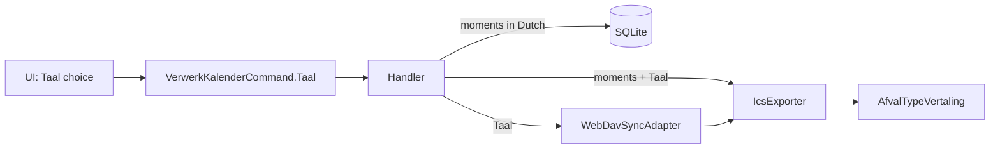

# ADR-011 — Language-Selectable ICS Output via Domain Translation Table

**Status:** Accepted  
**Date:** 2026-10-09  
**Deciders:** Marvin Storage

## Context

Issue #13 asks for calendar events in English (and later other languages) for expats. The stored `AfvalOphaalMoment.Omschrijving` is Dutch and drives change detection (`Update()`), domain events and the outbox (ADR-004). Translating at storage time would turn a language switch into a fake provider change.

## Decision

1. Add the Domain value object `Taal` (`Nederlands`, `Engels`) and a static lookup `AfvalTypeVertaling` (type + language -> description, plus the reminder prefix). The Domain keeps zero dependencies.
2. Translate **at output time**: `IcsExporter` writes the stored `Omschrijving` for `Nederlands` and the translated text for other languages. The database and the UID (`type_date_postcode`) do not change.
3. `Taal` travels as an explicit parameter: `VerwerkKalenderCommand.Taal` (default `Nederlands`) -> `IIcsExporter` and `IAfvalKalenderSynchronisator`.
4. UIs preselect the language from the system UI language; UI labels are not translated by this decision.
5. No `IStringLocalizer`/resx: six strings per language do not justify the dependency (CLAUDE.md library policy).

## Consequences

### Positive
- No schema change; existing databases and calendar UIDs keep working.
- A new language is one table entry plus an enum value.
- Dutch output stays identical.

### Negative / Trade-offs
- Two interface signatures change (`IIcsExporter`, `IAfvalKalenderSynchronisator`).
- Translations are code, not resource files, so adding many languages later may justify revisiting this with a superseding ADR.
- Events already in a calendar keep their old language until the file is imported again.
