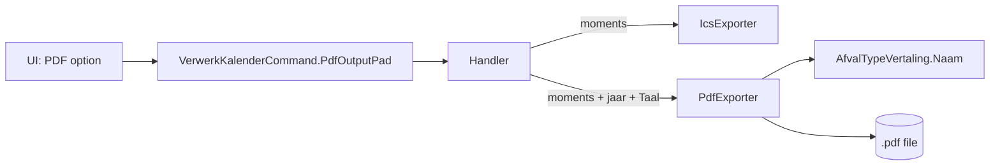

# ADR-012 — Printable PDF Export via a Custom Dependency-Free Writer

**Status:** Accepted  
**Date:** 2026-10-09  
**Deciders:** Marvin Storage

## Context

Issue #10 asks for a printable A4 year schedule (a paper calendar for the fridge) next to the `.ics` export. The same output is needed on Windows, Linux and Android, from three different UIs.

PDF libraries were considered against the library policy in CLAUDE.md:

- **QuestPDF**: community licence with revenue conditions, and native dependencies per platform.
- **PdfSharp / MigraDoc**: needs a font resolver and bundled fonts on Linux and Android.

The layout is simple: text and filled rectangles on one page.

## Decision

1. Add the Domain port `IPdfExporter.ExporteerAsync(momenten, bestandspad, jaar, taal)`.
2. Implement it as `PdfExporter` in `AfvalKalender.Infrastructure/Pdf` with **no third-party dependency**: a minimal PDF 1.4 writer (catalog, pages, one A4 page, the standard fonts Helvetica and Helvetica-Bold, one content stream, xref and trailer).
3. Layout: title with year and address, 12 month blocks in a 3 x 4 grid, Monday first, collection days as coloured cells (split per type when several types share a day), and a legend for the types that occur.
4. Text is WinAnsi (Latin-1); `(`, `)` and `\` are escaped and other characters become `?`. The content stream is not compressed, so tests can search for strings.
5. Colours live in the Infrastructure adapter; type names per language come from `AfvalTypeVertaling.Naam(type, taal)` in the Domain (ADR-011).
6. The command gets an optional `PdfOutputPad` (`null` means no PDF). The handler writes the PDF after the ICS export from the same persisted moments.

## Consequences

### Positive
- No new package, no licence or native-library risk, identical output on every platform.
- Fast and small; works in the self-contained and Android builds without extra setup.
- Testable by reading the generated bytes.

### Negative / Trade-offs
- We own a small PDF writer. Only Latin-1 text is supported; a language with other scripts needs embedded fonts and a superseding ADR.
- One page, fixed layout. Richer layouts (several pages, logo, compression) would justify revisiting a library.
- The visual result is checked by opening the file, not by automated tests.
