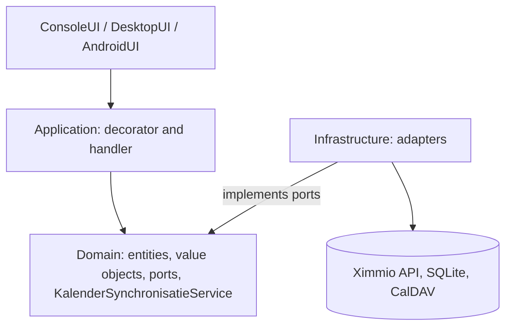

# Architecture

AfvalKalender follows a hexagonal (Ports and Adapters) architecture. The core knows nothing about databases, HTTP or user interfaces; those are connected through ports (interfaces in the Domain) and adapters.

```
Presentation  ->  Application  ->  Domain  <-  Infrastructure
```

Nothing may violate this flow. The decision record for the CQRS style is [ADR-001](../adr/ADR-001-light-cqrs-icommandhandler.md).



## Projects

| Layer | Project | What lives there |
|---|---|---|
| Domain | `AfvalKalender.Domain` | Entities (`AfvalKalender.Domain/Entities/Adres.cs`, `AfvalKalender.Domain/Entities/AfvalOphaalMoment.cs`), value objects, domain events, the domain service and the outbound ports. No NuGet packages. |
| Application | `AfvalKalender.Application` | `VerwerkKalenderCommand`, its handler, validator and the validating decorator. Also the legacy `AfvalKalender.Application/Services/AfvalService.cs`, superseded by the handler. |
| Infrastructure | `AfvalKalender.Infrastructure` | Driven adapters: Ximmio HTTP, cache, EF Core SQLite, ICS, sync. |
| Presentation | `AfvalKalender.ConsoleUI`, `AfvalKalender.DesktopUI`, `AfvalKalender.AndroidUI` | Thin driving adapters that build a command and call the handler. |

## Ports and adapters

| Port (Domain) | File | Adapter (Infrastructure) |
|---|---|---|
| `IAfvalApi` | `AfvalKalender.Domain/Interfaces/IAfvalApi.cs` | `AfvalKalender.Infrastructure/Api/TwenteMilieuApi.cs`, wrapped by `AfvalKalender.Infrastructure/Cache/CacherendeAfvalApi.cs` |
| `IAfvalRepository` | `AfvalKalender.Domain/Interfaces/IAfvalRepository.cs` | `AfvalKalender.Infrastructure/Persistence/EfAfvalRepository.cs` |
| `IIcsExporter` | `AfvalKalender.Domain/Interfaces/IIcsExporter.cs` | `AfvalKalender.Infrastructure/Ics/IcsExporter.cs` |
| `IAfvalKalenderSynchronisator` | `AfvalKalender.Domain/Interfaces/IAfvalKalenderSynchronisator.cs` | `AfvalKalender.Infrastructure/Sync/WebDavSyncAdapter.cs`; `AfvalKalender.Infrastructure/Sync/GoogleCalendarSyncAdapter.cs` and `AfvalKalender.Infrastructure/Sync/MicrosoftGraphSyncAdapter.cs` are stubs |

The class name `TwenteMilieuApi` is historical: it talks to the shared Ximmio API for all 16 providers, selected by `CompanyCode`.

## Domain pieces

- Entities: `Adres`, `AfvalOphaalMoment` (rich entity; `Update()` detects a changed description and raises an event).
- Value objects: `AfvalKalender.Domain/ValueObjects/AfvalType.cs` (`GRIJS`, `GROEN`, `PAPIER`, `VERPAKKINGEN`, `KERSTBOOM`, `ONBEKEND`), `AfvalKalender.Domain/ValueObjects/AfvalVerwerker.cs` (record `Id`, `Naam`, `CompanyCode`, with `AfvalVerwerkers.Alle`), `AfvalKalender.Domain/ValueObjects/SyncConfiguratie.cs` and `AfvalKalender.Domain/ValueObjects/SyncProvider.cs` (`Geen`, `WebDav`, `GoogleCalendar`, `MicrosoftGraph`).
- Events: `AfvalOphaalMomentToegevoegd`, `AfvalOphaalMomentGewijzigd`, both `IDomainEvent`.
- Domain service: `AfvalKalender.Domain/Services/KalenderSynchronisatieService.cs` picks the synchroniser whose `Ondersteunt(provider)` is true, and does nothing for `SyncProvider.Geen`.

## Composition roots

Each UI wires the dependencies itself:

| UI | File |
|---|---|
| Console | `AfvalKalender.ConsoleUI/Program.cs` (Generic Host) |
| Desktop | `AfvalKalender.DesktopUI/App.axaml.cs` (`ServiceCollection`) |
| Android | `AfvalKalender.AndroidUI/MauiProgram.cs` |

Every root registers the handler wrapped in `ValidatingCommandHandlerDecorator`, the cache around the HTTP API, the repository, the ICS exporter and all three synchronisers, and calls `Database.EnsureCreated()` on start. See [Database](database.md).

## Packaging

Console and Desktop ship as self-contained `.deb` and Windows zip packages, Android as a signed APK ([Releases](releases.md), [ADR-008](../adr/ADR-008-fixed-android-signing-key.md), [ADR-009](../adr/ADR-009-ubuntu-deb-packaging.md)).

## Known gaps

- Certificate validation is disabled for the Ximmio and WebDAV `HttpClient` instances (self-signed Ximmio certificate). See [security-transport](../../openspec/specs/security-transport/spec.md).
- Google and Microsoft sync adapters are stubs ([ADR-006](../adr/ADR-006-oauth2-calendar-apis.md), status Proposed).
- Outbox rows are written but nothing processes them yet (`ProcessedOn` stays empty).
