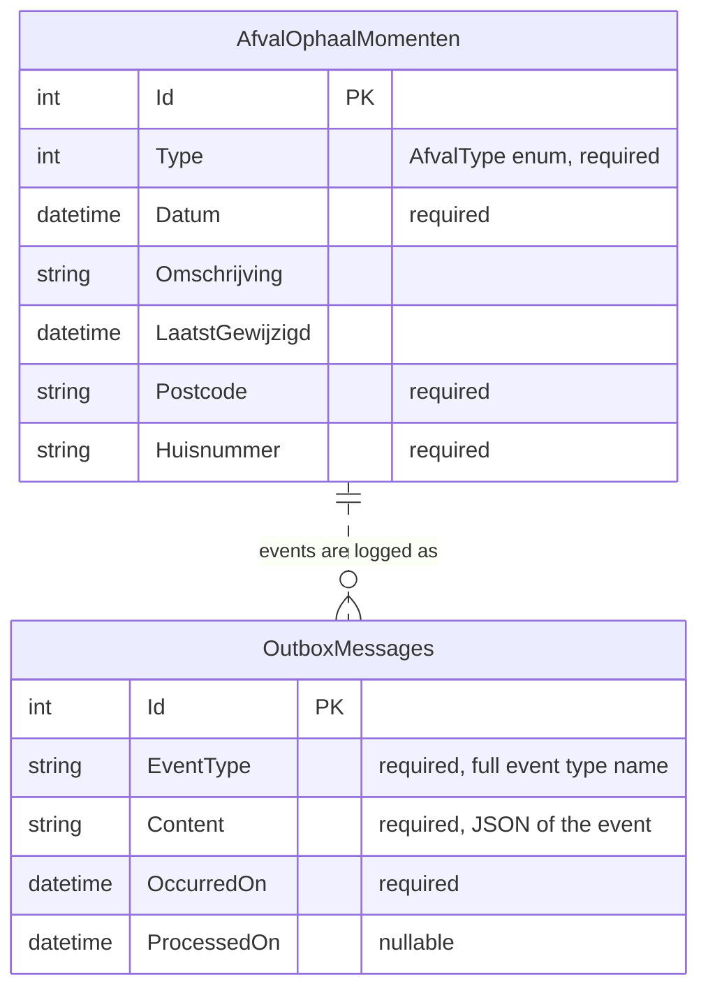

# Database

AfvalKalender stores data in SQLite through EF Core. The model is in `AfvalKalender.Infrastructure/Persistence/AfvalDbContext.cs`.

## Where the file lives

| Platform | Database path |
|---|---|
| Console, Desktop | `Environment.SpecialFolder.LocalApplicationData/AfvalKalender/afvalkalender.db` (for example `~/.local/share/AfvalKalender` on Linux) |
| Android | `FileSystem.AppDataDirectory/afvalkalender.db` |

The API cache is a separate folder of JSON files (`apicache/`), see [ADR-005](../adr/ADR-005-api-cache-decorator.md). Never commit either ([`.agents/AGENTS.md`](../../.agents/AGENTS.md)).

## Entity-relationship diagram

The two tables are not related by a foreign key. Outbox rows are copies of domain events that the repository writes in the same transaction as the change that caused them.

## Identity of a moment

`Id` is the primary key, but the repository treats `Postcode`, `Huisnummer`, the date part of `Datum` and `Type` as the natural key when it looks for an existing row (`AfvalKalender.Infrastructure/Persistence/EfAfvalRepository.cs`). The schema has no unique index for it.

## Schema creation: EnsureCreated, not migrations

All three apps call `Database.EnsureCreated()` on start (`AfvalKalender.ConsoleUI/Program.cs`, `AfvalKalender.DesktopUI/App.axaml.cs`, `AfvalKalender.AndroidUI/MauiProgram.cs`). That creates the schema when the file does not exist and never alters it.

The folder `AfvalKalender.Infrastructure/Migrations/` does contain one migration, `20260619150125_AddOutboxMessagesTable`, and a model snapshot. Nothing calls `Migrate()`, so those migrations are never applied at runtime. They are a leftover from adding the outbox; treat them as unused. Practical consequences:

- A database created before the outbox was added does not get the `OutboxMessages` table. Delete the file (or the data folder) and let the app recreate it.
- Changing the model means deleting the database, or switching deliberately to `Migrate()` with a decision record.

## Reading the data

`HaalOpVoorAdresEnJaarAsync` returns the moments for a postcode, huisnummer and year. The outbox is write-only for now: `ProcessedOn` stays empty because no processor exists yet ([ADR-004](../adr/ADR-004-domain-events-outbox.md)).
